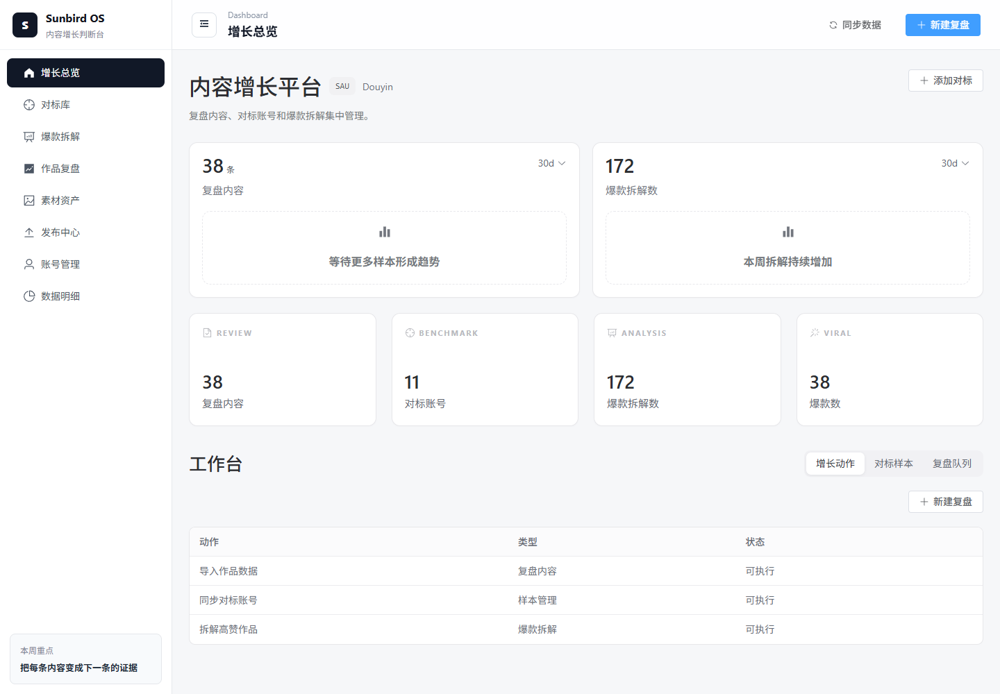

# Sunbird OS：把内容对标、拆解、复盘和发布放进一套桌面工作流

Sunbird OS 是太阳鸟基于开源项目 `social-auto-upload` 二次开发的本地内容运营工作台。

它不只是把“上传视频”做成一个桌面界面，而是把对标账号采集、爆款内容拆解、自有作品复盘、多账号管理和自动发布串成一条完整的内容工作流。

> 数据只是参考。真正有价值的，是从别人的内容里找到自己能讲的观点，再把它变成自己的作品。



## 目录

- [这版桌面版做了什么](#这版桌面版做了什么)
- [一条完整的内容工作流](#一条完整的内容工作流)
- [当前能力](#当前能力)
- [支持的平台](#支持的平台)
- [安装指南](#安装指南)
- [快速开始](#快速开始)
- [项目结构](#项目结构)
- [项目背景](#项目背景)
- [交流与支持](#交流与支持)
- [许可证](#许可证)

## 这版桌面版做了什么

### 1. 内容对标：贴一个链接，把账号和作品带回来

输入一个对标账号的主页链接，系统会自动同步：

- 账号昵称和头像
- 关注数、粉丝数和获赞数
- 账号作品数
- 最近发布的作品列表
- 作品标题、封面、点赞数和原始链接

不用再逐个打开主页、翻作品、截图和手工记数据。一个账号同步一次，就能沉淀成持续更新的对标内容库。

### 2. 内容拆解：不只看它为什么火，更要看我能用什么

内容拆解分为两层。

第一层是拆作品本身：

- 这条作品在说什么
- 开头用了什么钩子
- 核心观点是什么
- 内容结构怎么展开
- 哪些细节构成了传播爆点

第二层更重要，是拆“这条内容和我有什么关系”：

- 我能从哪个角度讲这件事
- 哪些观点可以迁移到自己的领域
- 哪些表达方式值得借鉴
- 哪些内容不能照搬，需要重新组织
- 它能不能继续变成自己的选题、脚本或交付物

**对标不是复制标题，而是把别人的有效方法，转化成自己的内容能力。**

### 3. 账号数据同步和流量诊断：让复盘有依据

登录自己的账号后，可以一键同步已发布作品和相关数据，并对账号或单条作品进行诊断。

系统会结合播放、点赞、完播、跳出等可用指标，帮助回答：

- 为什么这条作品播放低
- 为什么那条作品的数据更好
- 问题更可能出在选题、开头、内容结构还是账号状态
- 下一条作品应该优先调整什么

以前视频发出去以后，好坏往往只能靠感觉判断。现在至少可以把作品放在同一套数据和内容框架里对照着看。

### 4. 多账号矩阵管理：账号、数据和发布分开管理

如果你同时运营多个账号，可以在一个桌面端统一维护账号登录状态、作品数据和发布任务。

账号归账号，数据归数据，发布归发布。每一步都有清晰的入口，也能减少在多个浏览器窗口、表格和脚本之间来回切换。

### 5. 接入 Codex：从分析直接走到视频发布

Sunbird OS 提供了可供 Codex 调用的内容分析、作品复盘和视频发布能力。

配置完成后，可以让 Codex 根据对标数据做拆解、整理发布信息，并调用本地发布流程把视频发出去。分析不再停留在一份报告里，而是可以继续进入真实的内容生产和发布环节。

这是这版桌面端最想解决的问题：**让 AI 不只给建议，还能参与实际工作流。**

## 一条完整的内容工作流

1. **找对标**：添加账号主页链接，同步账号和近期作品。
2. **拆内容**：分析钩子、观点、结构、受众和爆点。
3. **找机会**：提炼自己可以迁移的观点与表达方向。
4. **做发布**：管理素材、选择账号并发布视频。
5. **看结果**：同步作品数据，诊断高低播放原因。
6. **继续迭代**：把复盘结论带回下一轮选题和创作。

从“我今天发什么”，到“这条内容为什么有效”，再到“下一条具体改哪里”，尽量在同一个系统里完成。

## 当前能力

| 模块 | 能力 |
| --- | --- |
| 对标内容库 | 添加对标账号、同步账号数据、沉淀近期作品 |
| 爆款拆解 | 分析开头钩子、核心观点、内容结构、爆点与可复刻方法 |
| 机会洞察 | 从对标内容中提炼可迁移方向、适配人群和延伸选题 |
| 作品复盘 | 同步自有作品数据，结合内容和流量指标进行复盘 |
| 账号诊断 | 对自有账号或对标账号生成结构化诊断报告 |
| 多账号管理 | 统一维护不同平台、不同账号的登录状态和发布入口 |
| 素材管理 | 上传、查询、复制和删除素材，并与发布中心联动 |
| 发布中心 | 选择素材和账号，执行单次、批量或定时发布 |
| Agent 模型 | 配置 Codex CLI 或兼容模型，为分析任务选择执行模型 |
| Codex 工具链 | 通过本地工具调用查询对标、复盘作品和发布视频 |

## 支持的平台

当前项目保留了原项目的多平台上传能力。

### 国内平台

- [x] 抖音
- [x] 视频号
- [x] Bilibili
- [x] 小红书
- [x] 快手
- [x] 百家号

### 国外平台

- [x] TikTok

不同平台的自动化能力和稳定性会受登录方式、页面更新及风控策略影响。请先使用测试账号和非重要素材验证流程，避免直接执行大批量发布。

## 安装指南

### 1. 克隆项目

```powershell
git clone https://github.com/dreammis/social-auto-upload.git
cd social-auto-upload
```

### 2. 安装 Python 依赖

建议在 Python 3.10 虚拟环境中运行：

```powershell
pip install -r requirements.txt
```

### 3. 安装前端依赖

```powershell
npm install
```

### 4. 安装 Playwright 浏览器

```powershell
playwright install chromium firefox
```

根据实际使用的平台，至少安装 Chromium。Firefox 主要用于旧版 TikTok 上传流程。

### 5. 创建本地配置

以 `conf.example.py` 为模板创建 `conf.py`，按需设置 Chrome 路径等本地配置。账号 Cookie、令牌、数据库和个人设置都不应提交到 Git。

首次运行前可初始化 SQLite 数据库：

```powershell
python db/createTable.py
```

## 快速开始

### 浏览器开发模式

启动后端：

```powershell
python sau_backend.py
```

后端默认运行在 `http://localhost:5409`。

启动前端：

```powershell
npm run frontend:dev
```

前端默认运行在 `http://localhost:5173`。

### Electron 桌面模式

先启动前端开发服务器，再运行：

```powershell
npm run desktop:dev
```

### 构建桌面版

```powershell
npm run frontend:build
npm run desktop:pack
```

生成安装包：

```powershell
npm run desktop:dist
```

### 使用发布能力

1. 在账号管理中登录需要运营的平台账号。
2. 将待发布的视频、封面和标题信息准备好。
3. 在素材管理或发布中心选择素材。
4. 选择目标账号、发布时间和其他平台参数。
5. 先用测试内容验证，再执行正式发布。

也可以参考 `examples/` 下的平台示例脚本，直接调用对应的 uploader。

## 项目结构

```text
social-auto-upload/
├── backend_app/        # 后端业务模块、公共能力与 Agent 运行时
├── electron/           # Electron 主进程、预加载脚本和桌面 sidecar
├── sau_frontend/src/   # Vue/Vite 前端源码
├── uploader/           # 各平台上传实现
├── tests/              # pytest 测试
├── examples/           # 平台调用示例
├── scripts/            # 构建与维护脚本
├── docs/               # 设计及项目文档
├── sau_backend.py      # 后端启动与应用装配入口
└── package.json        # 前端、Electron 与打包命令
```

## 项目背景

本仓库是太阳鸟基于开源项目 `social-auto-upload` 做的二次开发版本。

原项目解决的是多平台视频自动上传和定时发布；Sunbird OS 在此基础上继续向内容运营上游扩展，把对标研究、观点提炼、作品复盘、账号诊断和 AI 协作加入桌面端。

项目适合内容创作者、自媒体运营者、个人 IP 团队，以及希望用 AI 提升内容生产效率的人。它仍在持续迭代，使用前请自行评估平台规则、账号安全和自动化发布风险。

## 交流与支持

如果你对 AI 自媒体、内容自动化、对标账号拆解和短视频工作流感兴趣，可以关注太阳鸟公众号，或添加个人微信交流。

<table>
  <tr>
    <td align="center">
      
      <br />
      <strong>太阳鸟公众号</strong>
      <br />
      获取 AI 自媒体自动化运营案例
    </td>
    <td align="center">
      
      <br />
      <strong>太阳鸟个人微信</strong>
      <br />
      交流 AI 内容生产和自动化发布
    </td>
  </tr>
</table>

## 许可证

本项目采用 [NC 非商业许可协议](LICENSE)。

你可以在非商业目的下学习、研究、修改和分发本项目代码，但不得将本项目或其衍生作品用于任何商业用途。任何商业化使用、商业部署、商业服务、销售、再授权或用于营利性业务场景，均需事先获得项目作者的书面商业授权并支付相应授权费用。

未经授权的商业化使用将被视为侵权行为，项目作者保留追究法律责任、要求停止侵权、赔偿损失并提起诉讼的权利。

[](https://star-history.com/#dreammis/social-auto-upload&Date)
